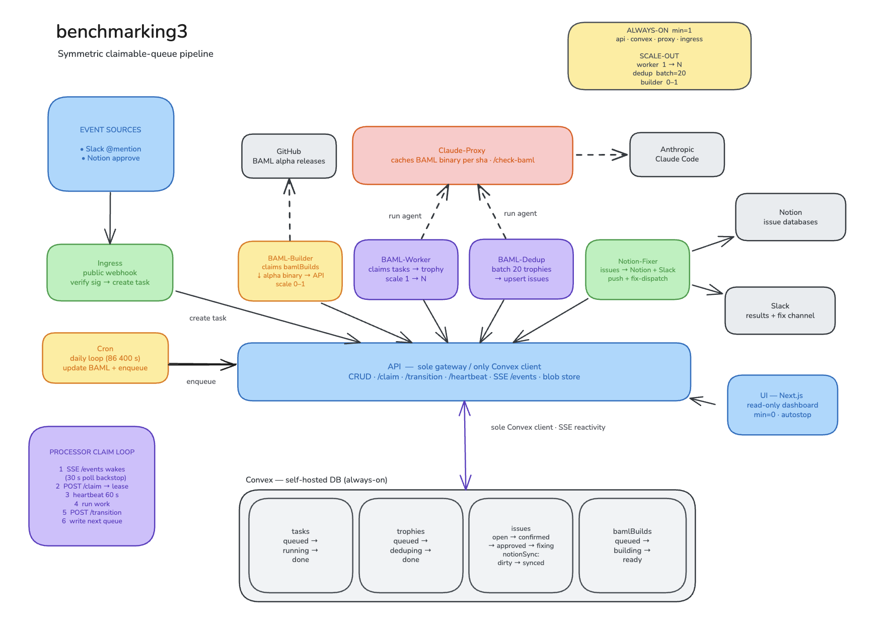

# baml-bench

An event-driven benchmarking pipeline for BAML. It runs coding agents against
benchmark tasks (with the latest canary `baml` CLI on `PATH`), collects a verbose
self-reported "trophy" for each run, deduplicates the findings into a tracked
issue list, and dispatches fixes - all while a dashboard reads live state.

The system is three things:

- **Python services** - long-lived stateless workers (`baml-worker`,
  `baml-dedup`, `notion-fixer`, `baml-builder`), the public `ingress` gateway,
  a `cron` driver, the `claude-proxy` agent runner, and a central `api` that is
  the only process allowed to talk to Convex.
- **Self-hosted Convex** - the database and queue substrate. Five tables
  (`tasks`, `trophies`, `issues`, `bamlBuilds`, `workers`) plus `taskEvents`,
  each a *claimable queue* drained by exactly one worker at a time.
- **Next.js dashboard** (`ui`) - a read-only view of the pipeline that reads
  through the `api`.

Everything is organized around one symmetric idea: **every stage is a claimable
queue on a Convex table, drained by a long-lived `Processor` that talks only to
the central `api`.**

## Pipeline



Triggers (Slack `@mention`, cron, bug report, Notion approve) create `tasks`
through the API. `baml-worker` claims a task and writes a `trophy`; `baml-dedup`
merges its findings into `issues`; `notion-fixer` syncs issues to Notion and
dispatches Cursor cloud-agent fixes; `baml-builder` keeps the canary `baml`
binary registry fresh. The API is the only Convex client; agents reach Anthropic
only through `claude-proxy`; the Next.js UI reads pipeline state through the API.
See [`docs/architecture.md`](docs/architecture.md) for the full walkthrough.

## Components

| Component | Role |
|---|---|
| `api` | The only Convex client. Central CRUD + queue verbs (claim / transition / heartbeat) + per-table SSE wake streams; stores transcript and baml-binary blobs on its own volume. |
| `claude-proxy` | Wraps `claude -p`; spawns the agent, parses the session into tokens/cost/turns, and caches a `baml` binary per sha on `PATH`. |
| `baml-worker` | Claims `tasks`; runs the agent (BAML skill injected, canary `baml` on `PATH`); the agent self-reports the whole verbose trophy; the worker verifies repros and creates the `trophy`. |
| `baml-dedup` | Claims `trophies`; authoritative skill/language classifier + cross-run merge; promotes findings/suggestions into `issues`. |
| `notion-fixer` | Two processors over `issues`: pushes confirmed issues to Notion (`notionSyncStatus` queue) and dispatches `@cursor` fixes on approval (`status` queue). |
| `ingress` | Public webhooks: `/slack/events`, `/notion/webhook`, `/bug`. Creates `tasks` and approves `issues`. |
| `cron` | Daily driver: refreshes baml (`POST /baml/update`) then enqueues benchmark `tasks`. |
| `baml-builder` | Claims `bamlBuilds`; downloads the prebuilt alpha-channel `baml` release binary for the sha and uploads it to the registry. |
| `ui` | Next.js dashboard; reads pipeline state through the `api`. |
| `convex` | Self-hosted Convex backend: schema, the generic claimable-queue library, per-table function modules, and the lease-reaper cron. |

## Documentation

| Doc | What it covers |
|---|---|
| [`docs/architecture.md`](docs/architecture.md) | Runtime architecture: the claimable-queue pattern, the Processor claim loop, per-table state machines, and the lease reaper. |
| [`docs/data-model.md`](docs/data-model.md) | The Convex schema: every table, field, index, and lifecycle. |
| [`docs/configuration.md`](docs/configuration.md) | Environment variables and how config is injected (local `.env` / Infisical). |
| [`docs/reference.md`](docs/reference.md) | Consolidated API reference - every function/class with a one-line summary. |

## Layout

```
convex/           schema.ts  lib.ts  {tasks,trophies,issues,bamlBuilds}.ts  crons.ts  maintenance.ts
libs/bench_core/  processor  service_client  proxy_client  schemas  prices
                  slack_client  notion_client  cursor_client  jsonl
docker/           Dockerfile.python  Dockerfile.claude-proxy
```
